<!-- ===================================================== -->
<!-- Stroke Risk Intelligence — README.md -->
<!-- Premium • Interactive • Recruiter-Ready -->
<!-- Brand-consistent banner • Recruiter-first • Creative visuals -->
<!-- ===================================================== -->

<div align="center">


<br/>


<br/><br/>

<a href="#-end-to-end-modeling-logic"><b>Modeling Logic</b></a> •
<a href="#-models-benchmarked"><b>Models</b></a> •
<a href="#-analytical-framework"><b>Framework</b></a> •
<a href="#-core-analytical-themes"><b>Themes</b></a> •
<a href="#-recruiter-snapshot"><b>Recruiter Snapshot</b></a> •
<a href="#-contact"><b>Contact</b></a>

</div>

---

# 🧬 End-to-End Modeling Logic

<details open>
<summary><b>🧠 Clinical Signal Orchestration (click to collapse)</b></summary>

<br/>

<div align="center">

### ⚙️ The Stroke Risk “Signal Factory”
A view of how raw health data becomes a risk decision.

```mermaid
flowchart LR
  A["🧾 Patient Signals<br/>Age • BMI • Glucose • HTN • Heart Disease • Smoking"] --> 
  B["🧹 Integrity Gate<br/>Missing values • type fixes • sanity checks"] -->
  C["🧬 Meaning Encoder<br/>Categoricals → one-hot<br/>clinical meaning preserved"] -->
  D["📏 Calibration<br/>scaling • normalization<br/>fair feature influence"] -->
  E["🧪 Evidence Split<br/>train/test boundary"] -->
  F["🏟️ Model Arena<br/>LR • DT • RF • KNN • GB"] -->
  G["⚖️ Risk Court<br/>recall-first selection<br/>error-map review"] -->
  H["🎯 Output<br/>stroke probability"]
```

</div>



<div align="center">

#### 🧠 What makes this *not* a generic pipeline
Instead of optimizing for “best accuracy”, this flow is built to reduce **false negatives** — because missing a high-risk patient is the most expensive mistake.

</div>

</details>

---

# ⚔️ Models Benchmarked

<details open>
<summary><b>🏁 “Model League Cards” — not a table (click to collapse)</b></summary>

<br/>

<div align="center">

<table>
<tr>
<td width="20%" valign="top">

### 🩺 Logistic Regression  
**Role:** Baseline clinician  
**Strength:** Probability clarity  
**Wins when:** interpretability + stability matter

</td>
<td width="20%" valign="top">

### 🌳 Decision Tree  
**Role:** Rule explainer  
**Strength:** Human readable paths  
**Wins when:** justification is critical

</td>
<td width="20%" valign="top">

### 🌲 Random Forest  
**Role:** Stability engine  
**Strength:** Robust ensembles  
**Wins when:** noise/variance exists

</td>
<td width="20%" valign="top">

### 🧭 KNN  
**Role:** Similar-patient matcher  
**Strength:** Local pattern discovery  
**Wins when:** clusters are meaningful

</td>
<td width="20%" valign="top">

### ⚡ Gradient Boosting  
**Role:** Precision finisher  
**Strength:** Strong signal learning  
**Wins when:** performance needs refinement

</td>
</tr>
</table>

</div>

<div align="center">
<sub>All models are evaluated under the same boundaries so improvements are real — not accidental.</sub>
</div>

</details>

---

# ⚖️ Analytical Framework

<details open>
<summary><b>🏥 Risk Review Board — evaluation that sounds like healthcare (click to collapse)</b></summary>

<br/>

<div align="center">

### 🧾 “Clinical Evaluation Brief”
A compact decision memo style, not a metric list.

</div>

> **1) Safety First — Recall**  
> If the model misses stroke-positive cases, it fails the healthcare requirement.

> **2) Alarm Discipline — Precision**  
> Too many false alarms creates unnecessary escalation and reduces trust.

> **3) Balanced Judgment — F1**  
> Ensures the model isn’t good at only one thing.

> **4) Error Autopsy — Confusion Matrix**  
> Shows *how* the model fails, not just *how much* it fails.

> **5) Separation Strength — ROC-AUC**  
> Tests whether the model genuinely distinguishes low vs high risk.

<div align="center">
<b>Selection Rule:</b> accuracy never overrides clinical cost.
</div>

</details>

---

# 🧠 Core Analytical Themes

<details open>
<summary><b>🧩 “Theme Board” — styled like a brand panel (click to collapse)</b></summary>

<br/>

<div align="center">

<!-- classy "panels" without mermaid -->
<table>
<tr>
<td width="33%" valign="top">

### 🩺 Risk Sensitivity
- Recall-first mindset  
- False-negative control  
- Minority class awareness  
- Threshold thinking  

</td>
<td width="33%" valign="top">

### 🧱 Engineering Discipline
- Clean preprocessing chain  
- Comparable benchmarks  
- Stable feature handling  
- Reproducible evaluation  

</td>
<td width="33%" valign="top">

### 🧠 Clinical Reasoning
- Metrics mapped to impact  
- Decision framing  
- Error interpretation  
- Responsible ML lens  

</td>
</tr>
</table>

</div>

<div align="center">
<sub>This project demonstrates applied ML behavior — not “train model, print accuracy”.</sub>
</div>

</details>

---

# 🌟 Why This Project Matters

<details open>
<summary><b>✨ Recruiter Story Mode — “Decision System, not a notebook” (click to collapse)</b></summary>

<br/>

<div align="center">

### 🧠 The difference

</div>

```text
Most projects:   "I trained a classifier."
This project:    "I designed a risk-sensitive decision architecture."
```

<div align="center">

### 🎯 What’s special here

</div>

- **Healthcare cost-aware evaluation** (recall prioritized for safety)  
- **Benchmarking discipline** (models compared fairly, same boundaries)  
- **Interpretation mindset** (error behavior analyzed, not hidden)  
- **Recruiter clarity** (communicates impact + engineering maturity)

</details>

---

# 🎯 Recruiter Snapshot

<details open>
<summary><b>📌 What a recruiter should remember in 15 seconds (click to collapse)</b></summary>

<br/>

<div align="center">

<table>
<tr>
<td width="50%" valign="top">

### ✅ What I demonstrated
- End-to-end ML system thinking  
- Class-imbalance awareness  
- Model benchmarking discipline  
- Healthcare-first evaluation logic  
- Clear analytical communication  

</td>
<td width="50%" valign="top">

### 🧠 Why it’s valuable
- Medical ML demands safety metrics  
- False negatives are costlier than false positives  
- Evaluation isn’t reporting — it’s design  
- This reflects applied ML maturity  

</td>
</tr>
</table>

</div>

</details>

---

# 📬 Contact

<div align="center">

<a href="https://www.linkedin.com/in/navyashree-byregowda-472821196/">

</a>

<a href="https://github.com/Navyagowda2714">

</a>

<a href="mailto:navyashreebyregowda@gmail.com">

</a>

<br/><br/>
<sub>Stroke Risk Intelligence — responsible healthcare prediction through risk-aware machine learning.</sub>

</div>
